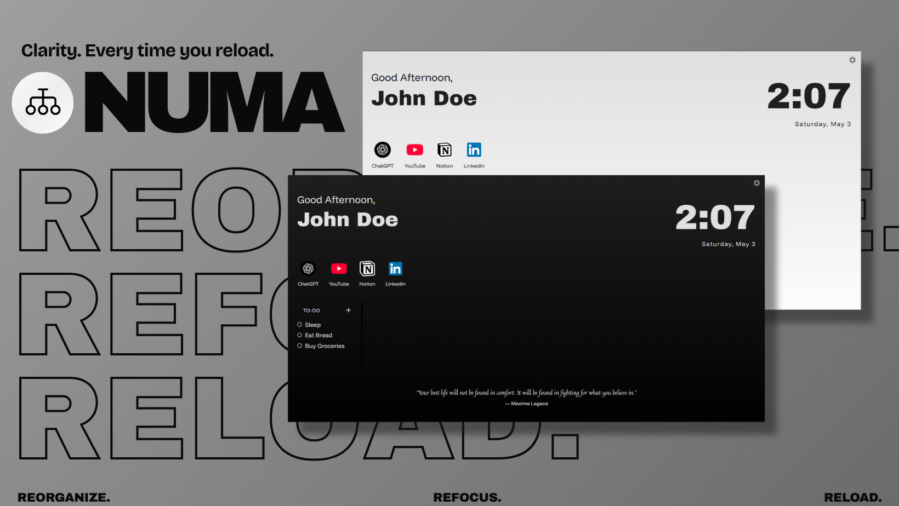

#  NUMA
> _“Reorganize. Refocus. Reload.”_  

---

## 📋 Table of Contents

1. [What Is NUMA?](#what-is-NUMA)  
2. [Key Features](#key-features--expected)
3. [Usage](#Usage--expected)
4. [Design](#design)  
5. [Next Steps](#next-steps)  
6. [License](#license)

---

## 🔍 What Is NUMA?

NUMA is your soon-to-arrive browser sidekick, a sleek Chrome extension that transforms your default new-tab page into a distraction-eating, focus-boosting dashboard.
Think of it as your browser wearing noise-canceling headphones: all you hear is focus.

Or, if you prefer acronyms: **Neutral Utility for Maintaining Attention.**

> **Still in development.** Prototype pending – code is alive, but not quite breathing yet.

---

## ✨ Key Features (Expected)

- **Quick Links (Up to 4)**  
  Hand‑pick your daily essentials—limited slots to keep distractions at bay.
- **Mini To‑Do List**  
  Jot down “must‑do’s” so your next page load is a prompt to execute, not procrastinate.
- **Live Clock & Date Display**  
  Always know the hour. (No more frantic glances at your phone.)
- **Time-Based Greeting**  
  Contextual greeting based on time of day. Not too important, but always nice to have.
- **Daily Inspiration (via ZenQuotes API)**  
  A fresh quote each day. (Fun facts option under consideration for a dash of trivia.)
- **Light & Dark Themes**  
  Switch moods effortlessly—your eyeballs will thank you.

---

## 🚀 Usage (Expected)

- Click the gear icon in the top-right to open **Settings** and configure.
- Add up to four **Quick Links**.
- Enter tasks in the **To-Do** section.
- Open/Refresh a new tab to see your custom dashboard.

---

## 🛠️ Tech Stack

- **Frontend:** HTML, CSS, JavaScript  
- **Animation (Prospective):** GSAP

---

## 📸 Design

> _“Design is never finished—only paused.”_

  

 

---

## 📈 Next Steps
 - Turn prototype into fully working MVP
 - Additional Customizations using settings
 - Fun fact mode toggle
 - Official Chrome Web Store release

 ---
 
## 📜 License

Distributed under the MIT License. See LICENSE for details.

---
